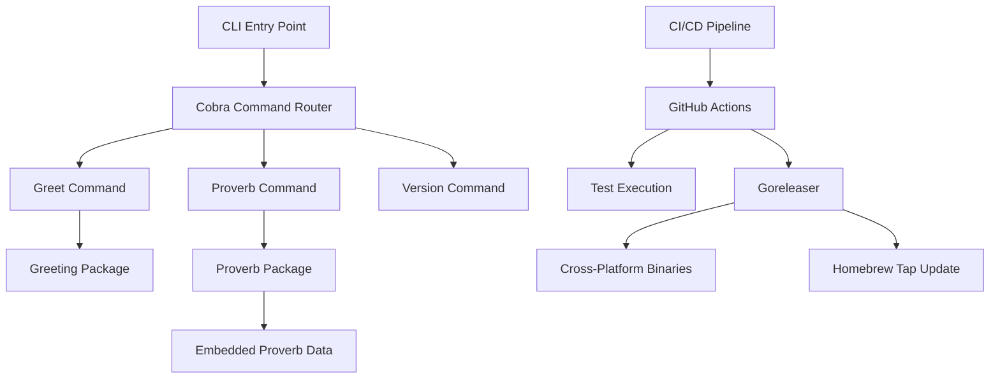

# Design Document

## Overview

The Hello-Gopher CLI is designed as a lightweight, professional-grade command-line tool that demonstrates Go development excellence. The architecture follows the standard Go project layout and leverages industry-standard libraries to create a maintainable, testable, and distributable CLI application.

The design emphasizes simplicity while incorporating professional features like comprehensive testing, CI/CD integration, cross-platform distribution, and proper documentation. This serves as both a functional tool and a portfolio piece showcasing Go development best practices.

## Architecture

### High-Level Architecture

The architecture follows a clean separation of concerns with the CLI layer handling user interaction, the business logic layer managing core functionality, and the data layer providing embedded resources. The CI/CD pipeline automates testing, building, and distribution across multiple platforms.



**Flow Description:**
- User commands flow through Cobra's router to specific command handlers
- Commands delegate business logic to the greeting package
- Proverb data is embedded at compile time for zero external dependencies
- CI/CD automation ensures quality and seamless distribution

### Project Structure

The project follows the Standard Go Project Layout for maintainability and community familiarity. This structure separates concerns clearly and makes the codebase easy to navigate for contributors and reviewers.

```
01-hello-gopher/
├── cmd/
│   └── hello-gopher/
│       ├── main.go              # Application entry point
│       └── cmd/
│           ├── root.go          # Root command and CLI setup
│           ├── greet.go         # Greet command implementation
│           ├── proverb.go       # Proverb command implementation
│           └── version.go       # Version command implementation
├── pkg/
│   └── greeting/
│       ├── greeting.go          # Core greeting logic
│       ├── greeting_test.go     # Unit tests
│       ├── proverb.go          # Proverb functionality
│       └── proverb_test.go     # Proverb tests
├── scripts/
│   └── proverb.txt             # Embedded proverb data
├── .github/
│   └── workflows/
│       └── ci.yml              # GitHub Actions CI/CD
├── .goreleaser.yaml            # Release configuration
├── Dockerfile                  # Container image (optional)
├── README.md                   # Project documentation
├── go.mod                      # Go module definition
├── go.sum                      # Dependency checksums
└── BUILD.md                    # Complete build guide
```

## Components and Interfaces

### CLI Layer (cmd/)

**Root Command (`cmd/hello-gopher/cmd/root.go`)**
- Initializes Cobra application
- Sets up global flags and configuration
- Coordinates subcommands
- Handles application-level error handling

**Command Implementations**
- `greet.go`: Handles greeting functionality with name flag support
- `proverb.go`: Manages random proverb display
- `version.go`: Provides version information with build details

**Main Entry Point (`cmd/hello-gopher/main.go`)**
- Minimal entry point that delegates to Cobra
- Ensures clean separation of concerns

### Business Logic Layer (pkg/)

**Greeting Package (`pkg/greeting/`)**

```go
// Core interfaces designed for testability and decoupling
type Greeter interface {
    Greet(name string) string
}

// ProverbProvider interface allows for easy mocking of proverb data,
// ensuring isolated unit tests without file system dependencies
type ProverbProvider interface {
    RandomProverb() string
    LoadProverbs() error
}

// Implementation
type Service struct {
    proverbs []string
}

func (s *Service) Greet(name string) string
func (s *Service) RandomProverb() string
func (s *Service) LoadProverbs() error
```

### Data Layer

**Embedded Resources**
- `scripts/proverb.txt`: Contains 50+ Go proverbs
- Embedded using Go's `//go:embed` directive
- Loaded once at application startup
- Provides deterministic behavior for testing

## Data Models

### Configuration Model

```go
type Config struct {
    Version   string
    BuildDate string
    GitCommit string
}
```

### Command Models

```go
type GreetOptions struct {
    Name string
}

type ProverbOptions struct {
    // Future: could include filtering options
}

type VersionInfo struct {
    Version   string
    BuildDate string
    GitCommit string
    GoVersion string
}
```

### Proverb Model

```go
// Proverb model is designed for future extension, allowing for attribution 
// of proverbs without changing the core business logic
type Proverb struct {
    Text   string
    Source string // Future: attribution to original authors/sources
}
```

## Error Handling

### Error Categories

1. **User Input Errors**: Invalid flags, missing arguments
2. **System Errors**: File access, permission issues
3. **Application Errors**: Empty proverb list, initialization failures

### Error Handling Strategy

```go
// Custom error types for better error handling with user guidance
type CLIError struct {
    Code       int
    Message    string
    Cause      error
    Suggestion string // Provides actionable guidance to users
}

func (e *CLIError) Error() string {
    if e.Suggestion != "" {
        return fmt.Sprintf("%s\nSuggestion: %s", e.Message, e.Suggestion)
    }
    return e.Message
}

// Error codes
const (
    ExitSuccess = 0
    ExitUsageError = 1
    ExitDataError = 2
    ExitSystemError = 3
)
```

### Error Response Format

- User-friendly messages for common errors
- Detailed error information in verbose mode
- Proper exit codes for scripting compatibility
- Suggestions for error resolution when applicable

## Testing Strategy

### Unit Testing

**Test Coverage Goals**
- Minimum 80% code coverage
- 100% coverage for core business logic
- Edge case coverage for all public functions

**Testing Approach**
```go
// Table-driven tests for greeting functionality
func TestGreet(t *testing.T) {
    tests := []struct {
        name     string
        input    string
        expected string
    }{
        {"default", "", "Hello, Gopher!"},
        {"custom name", "Alice", "Hello, Alice!"},
        {"empty string", "", "Hello, Gopher!"},
        {"special characters", "José", "Hello, José!"},
    }
    
    for _, tt := range tests {
        t.Run(tt.name, func(t *testing.T) {
            result := Greet(tt.input)
            assert.Equal(t, tt.expected, result)
        })
    }
}
```

**Test Categories**
- Unit tests for individual functions
- Integration tests for command execution
- Benchmark tests for performance validation
- Example tests for documentation
- Mock-based tests demonstrating clean architecture

**Mock Testing Example**
```go
// Demonstrates testability through interface mocking
type mockProverbProvider struct {
    proverbs []string
}

func (m *mockProverbProvider) RandomProverb() string {
    return m.proverbs[0] // Predictable for testing
}

func (m *mockProverbProvider) LoadProverbs() error {
    return nil
}

func TestProverbCommand(t *testing.T) {
    mockProvider := &mockProverbProvider{
        proverbs: []string{"Test proverb for unit testing"},
    }
    // Test with predictable mock data...
}
```

### CLI Testing

**Command Testing Strategy**
```go
// Test CLI commands using Cobra's testing utilities
func TestGreetCommand(t *testing.T) {
    cmd := NewRootCmd()
    cmd.SetArgs([]string{"greet", "--name", "Test"})
    
    output := captureOutput(func() {
        err := cmd.Execute()
        assert.NoError(t, err)
    })
    
    assert.Contains(t, output, "Hello, Test!")
}
```

### Continuous Integration Testing

**GitHub Actions Pipeline**
- Go version matrix testing (1.21, 1.22)
- Cross-platform testing (Linux, macOS, Windows)
- Race condition detection
- Code coverage reporting
- Dependency vulnerability scanning

## Build and Release Process

### Development Build

```bash
# Local development
go build -o hello-gopher ./cmd/hello-gopher

# With version information
go build -ldflags "-X main.version=dev -X main.buildDate=$(date -u +%Y-%m-%dT%H:%M:%SZ)" \
    -o hello-gopher ./cmd/hello-gopher
```

### Release Process

**Goreleaser Configuration**
- Cross-platform binary generation
- Archive creation with checksums
- GitHub release automation
- Homebrew tap integration
- Docker image publishing (optional)

**Supported Platforms**
- Linux: amd64, arm64
- macOS: amd64, arm64 (Apple Silicon)
- Windows: amd64, arm64

### Distribution Strategy

**Homebrew Integration**
```yaml
# .goreleaser.yaml excerpt
brews:
  - repository:
      owner: louiellywton
      name: homebrew-tap
    homepage: https://github.com/louiellywton/go-portfolio
    description: "Friendly greeter for gophers"
    install: |
      bin.install "hello-gopher"
```

**Installation Methods**
1. **Homebrew** (Recommended): `brew install louiellywton/tap/hello-gopher`
2. **Direct download**: Pre-compiled binaries from GitHub releases (no Go required)
3. **Docker**: `docker run ghcr.io/louiellywton/hello-gopher`
4. **Go install**: `go install github.com/louiellywton/go-portfolio/01-hello-gopher/cmd/hello-gopher@latest`

*Note: Pre-compiled binaries make the tool accessible to users without Go installed, expanding the potential user base beyond Go developers.*

## Security Considerations

### Dependency Management
- Regular dependency updates via Dependabot
- Vulnerability scanning with `govulncheck`
- Minimal dependency footprint
- Pinned dependency versions

### Build Security
- Reproducible builds with version pinning
- Checksum verification for releases
- Signed releases (future enhancement)
- SBOM generation for transparency

## Performance Considerations

### Startup Performance
- Fast initialization with embedded resources
- Lazy loading where appropriate
- Minimal memory footprint
- Quick command execution

### Resource Usage
- Embedded proverb data (~2KB)
- Minimal runtime memory usage
- No external network dependencies
- Efficient random number generation

## Documentation Strategy

### User Documentation
- Comprehensive README with examples
- Built-in help text with usage examples
- Man page generation for Unix systems
- Online documentation site (future)

### Developer Documentation
- Go doc comments for all public APIs
- Architecture decision records
- Contributing guidelines
- Code examples and tutorials

### API Documentation
```go
// Package greeting provides functionality for generating friendly greetings
// and displaying Go programming proverbs.
//
// Example usage:
//   service := greeting.NewService()
//   fmt.Println(service.Greet("World"))
//   fmt.Println(service.RandomProverb())
package greeting
```

This design provides a solid foundation for implementing a professional-grade CLI tool that serves as an excellent portfolio piece while demonstrating Go development best practices.